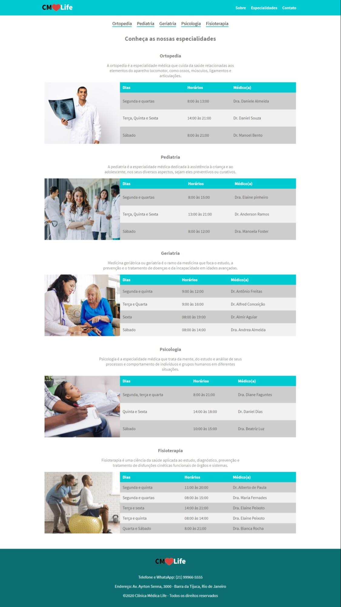

# Project Clinica Medica Life
 Medica Life clinic website created using HTML-CSS

- Homepage

- Specialists page

### About
  HTML-CSS project that simulates a medical clinic website

### Functionalities
- Navigate between home and specialists page

### Learnings
- HTML structure
- CSS styling
- Media querys for responsive design

## Installing

Clone this repository
- `` git clone https://github.com/celioFagundes/Projeto-Clinica-HTML-CSS.git``
- `` cd Projeto-Clinica-HTML-CSS``
- `` open index.html ``
